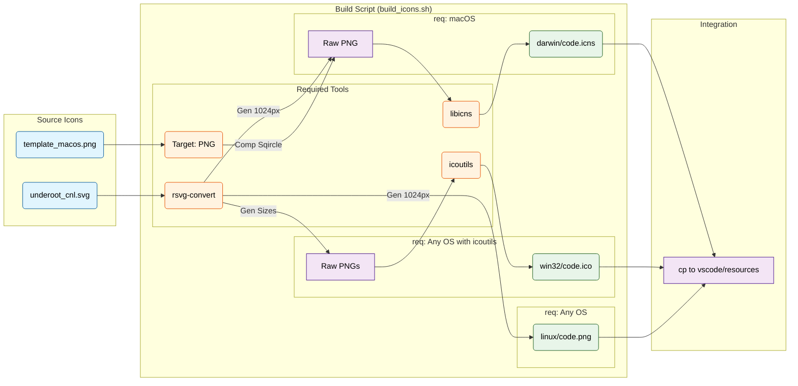

# Icon Generation and Handling

This document explains how icons are generated and integrated into the Underoot application for different platforms (macOS, Windows, Linux), and details the execution context differences between CI and Local environments.

## Overview

The icon generation process allows us to create platform-specific icon files (`.icns`, `.ico`, `.png`) from a single set of source SVG files. This ensures consistency and allows for easy updates to the brand identity.

## Source Files

The source icons are located in the `icons/` directory:
*   **`icons/stable/underoot_cnl.svg`**: The main logo used for "Color Normal" (standard application icon).
*   **`icons/stable/underoot_clt.svg`**: The "Color Light" version, often used for file type icons or smaller representations.
*   **`icons/template_macos.png`**: A template background used for macOS icons to ensure they match the OS aesthetic (squircle shape).

## Build Process (`icons/build_icons.sh`)

The `icons/build_icons.sh` script is the core generator. It is designed to run on **macOS**, **Linux**, and **Windows** (via Git Bash/WSL), but primarily runs on **macOS CI runners** to generate assets for all platforms.

It uses the following tools:
*   `rsvg-convert` (`librsvg`): Converts SVG to PNG. **Critical Failure Point in CI**.
*   `convert` / `composite` (`imagemagick`): Resizes and overlays images.
*   `png2icns` (`libicns`): Creates the macOS `.icns` file.
*   `icotool` (`icoutils`): Creates the Windows `.ico` file.

## Execution Contexts & Failure Analysis

### 1. GitHub Actions (CI)
*   **Process**: The workflow (`stable-macos.yml`) installs tools via Homebrew (`brew install ...`).
*   **Failure Cause**: On GitHub Actions runners, Homebrew installs packages into isolated "keg" directories (e.g., `/opt/homebrew/Cellar/...`) and does not always successfully link them to the system `PATH` immediately.
*   **Result**: When `icons/build_icons.sh` runs, it calls `rsvg-convert`, but the shell cannot find the binary, resulting in `command not found`.
*   **Fix**: The script now uses a "Shotgun Strategy" to auto-detect Homebrew locations and manually add them to `PATH`.

### 2. Local Environment
*   **Process**: Developer runs scripts manually.
*   **Why it works**: A developer's shell config (`.zshrc` / `.bash_profile`) usually handles Homebrew path setup perfectly upon login. The tools are available in standard locations (`/usr/local/bin` or `/opt/homebrew/bin`).

## Integration Flow

### 3. Build Process Termination (Execution Fix)
*   **Problem**: `icons/build_icons.sh` uses `exit 0` when skipping generation (because icons already exist).
*   **Failure Cause**: `prepare_vscode.sh` was *sourcing* the script (`. icons/build_icons.sh`). The `exit 0` command terminated the entire parent process, causing the rest of the build to be skipped.
*   **Fix**: Updated `prepare_vscode.sh` to execute the script as a subprocess (`./icons/build_icons.sh`). This ensures the exit code only terminates the child process.

## Integration Flow

The `prepare_vscode.sh` script orchestrates the build:
1.  **Detects OS**: Determines which host OS it is running on.
2.  **Calls Builder**: Executes `./icons/build_icons.sh` (as a subprocess).
    *   **Skip Check**: If `src/stable/resources/` already contains icons, the builder exits immediately.
3.  **Copies Assets**: Moves generated icons from `src/stable/resources/` to `vscode/resources/`.

## Architecture Diagram

