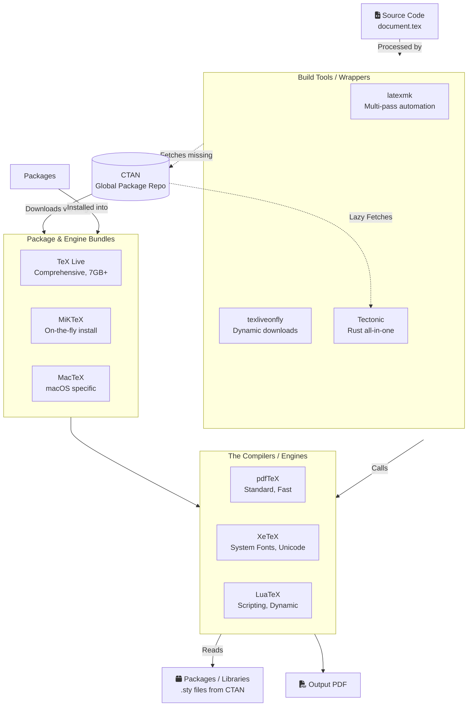

# The LaTeX Ecosystem: A Comprehensive Guide

LaTeX can be intimidating because it isn't just one program—it is a vast, decades-old ecosystem of engines, distributions, packages, and build tools. This document breaks down how LaTeX actually works under the hood, from the core rendering engines to modern cloud editors.

---

## Architecture of the LaTeX Ecosystem

Here is how the different pieces of the LaTeX puzzle fit together:



## 1. The Core Engines (The Compilers)
At its core, LaTeX is a markup language. An "engine" is the actual compiler that reads your `.tex` plain text file and converts it into a formatted document (usually a PDF). 

*   **TeX**: The original engine created by Donald Knuth in 1978. It outputs `.dvi` (Device Independent) files. Nobody uses raw TeX directly today.
*   **pdfTeX / pdflatex**: The standard engine for the last two decades. It added the ability to output `.pdf` files directly instead of `.dvi`. It is fast and stable but struggles with system fonts (TrueType/OpenType) and complex non-Latin scripts.
    ```bash
    # Command line usage
    pdflatex my_document.tex
    ```
*   **XeTeX / xelatex**: Developed to solve pdfTeX's font problem. XeTeX natively supports Unicode (UTF-8) and allows you to use any font installed on your operating system (via the `fontspec` package).
    ```latex
    % Example inside a .tex file compiled with xelatex
    \usepackage{fontspec}
    \setmainfont{Times New Roman} % Works instantly if installed on OS!
    ```
*   **LuaTeX / lualatex**: The designated official successor to pdfTeX and XeTeX. It includes an embedded Lua scripting engine, allowing advanced dynamic programming, complex calculations, and deep modifications to the TeX rendering process directly inside the document.
    ```latex
    % Example computing math inside LaTeX using Lua
    \directlua{
        tex.print("The square root of 144 is " .. math.sqrt(144))
    }
    ```

---

## 2. Packages (The Libraries)
Before discussing distributions, it is important to understand **packages** (`.sty` files). Packages are essentially libraries or modules written by the community to extend LaTeX's base functionality.

*   **Engine Dependency**: Most packages (like `amsmath`, `graphicx`, `geometry`) are engine-agnostic and work with pdflatex, xelatex, or lualatex.
*   **Engine Specific**: Some packages explicitly require a specific engine.
    *   `fontspec`: **Requires** XeTeX or LuaTeX. It will crash on pdfTeX.
    *   `microtype`: Historically pdfTeX-only, though mostly supported by others now.
    *   `luacode`: **Requires** LuaTeX.

```latex
% Example of standard package usage in a document preamble
\documentclass{article}
\usepackage[margin=1in]{geometry} % Sets margins
\usepackage{graphicx}             % Allows inserting images
\begin{document}
    \includegraphics{my_photo.png}
\end{document}
```

---

## 3. Distributions (The Complete Toolchains)
An engine by itself is useless without fonts, macros, and standard packages (like `amsmath`, `graphicx`, etc.). A **distribution** is a massive collection that bundles the engines with all these necessary files.

*   **TeX Live**: The absolute standard, cross-platform distribution (Windows, Linux, macOS). A "full" installation is over 7GB.
    ```bash
    # Pseudocode for how a package manager updates a TeX Live installation
    tlmgr update --all          # Updates all packages
    tlmgr install pgfplots      # Installs a specific package
    ```
*   **MacTeX**: Simply a repackaged version of TeX Live optimized for macOS.
*   **MiKTeX**: Popular on Windows. Its defining feature is **"on-the-fly" package installation**. 
    *   *Pseudocode Workflow*: `pdflatex` hits `\usepackage{newpackage}` $\rightarrow$ Not found locally $\rightarrow$ MiKTeX halts compilation $\rightarrow$ downloads `newpackage.sty` from internet $\rightarrow$ Resumes compilation.

---

## 4. Package Management & CTAN
*   **CTAN (Comprehensive TeX Archive Network)**: This is the central, authoritative repository for all TeX-related materials (packages, fonts, documentation, macros). Think of it as the `npm` for Node.js or `PyPI` for Python, but for LaTeX.
*   When you install a distribution like TeX Live or use MiKTeX, the package managers (`tlmgr` for TeX Live) pull the required packages and updates directly from CTAN mirrors worldwide.

---

## 5. Modern Build Tools & Wrappers
LaTeX often requires multiple compilation passes. For example, to generate a bibliography or Table of Contents, you might have to run: `pdflatex` $\rightarrow$ `biber` $\rightarrow$ `pdflatex` $\rightarrow$ `pdflatex`. Build tools automate this pipeline.

*   **latexmk**: A classic, highly reliable Perl script included in almost all distributions. It intelligently analyzes your `.tex` file and automatically runs the necessary engines (pdflatex, bibtex, makeindex, etc.) the exact number of times required to resolve all cross-references.
*   **texliveonfly**: A Python script designed for TeX Live to mimic MiKTeX's best feature. If a `pdflatex` build fails because a package is missing, `texliveonfly` detects the missing `.sty` file error, uses `tlmgr` (TeX Live's package manager) to install the missing package from CTAN, and then restarts the build automatically. 
*   **Tectonic**: A modern, revolutionary reinvention of the TeX tooling, written in Rust. 
    *   **How it works**: It uses a fork of the XeTeX engine but completely strips away the need for a massive local installation like TeX Live. 
    *   **Self-contained**: It is a single standalone executable file.
    *   **Cloud-fetching**: When you compile a document, Tectonic parses the file, silently downloads exactly the required packages from a cloud bundle (derived from CTAN) into a local caching directory, and compiles the PDF. 
    *   **Automated**: It completely handles the multiple passes (like `latexmk` does) internally without requiring external scripts.

---

## 6. Editing Environments: Local vs. Cloud

### Local Environments (VS Code + LaTeX Workshop, TeXstudio, TeXworks)
When you use a local IDE, the editor itself doesn't know how to compile LaTeX; it acts as an interface.
1.  **The Setup**: You must install a distribution (TeX Live / MiKTeX / Tectonic) separately on your operating system.
2.  **The Execution**: Extensions like **LaTeX Workshop** in VS Code act as a bridge. They watch your `.tex` file for saves, and then execute a terminal command (a "recipe" or "toolchain") in the background—typically calling `latexmk` or `tectonic`.
3.  **SyncTeX**: A critical technology used by local editors. When the engine compiles the PDF, it generates a `.synctex.gz` file mapping spatial coordinates in the PDF to specific line numbers in the `.tex` file. This allows you to Ctrl+Click the source code and jump to the exact spot in the PDF viewer, and vice versa (forward and inverse search).

### Cloud Environments (Overleaf)
Overleaf abstracts away the headaches of local installations, platform-specific bugs, and package management.
1.  **The Architecture**: When you open an Overleaf project, your browser acts as a text editor connecting to Overleaf's backend infrastructure. They run massive Linux server clusters (typically Docker containers) pre-loaded with comprehensive, full **TeX Live** installations.
2.  **The Compilation**: When you click "Recompile" (or have auto-compile on), Overleaf sends your source files to an ephemeral container. The server executes `latexmk` (using pdflatex, xelatex, or lualatex based on your compiler settings), generates the PDF logs, and streams the finished PDF back to an embedded PDF.js viewer in your browser.
3.  **Benefits**: Real-time Google Docs-style collaboration (using operational transformation), guaranteed reproducibility (everyone uses the exact same TeX Live image), and absolutely zero local setup time.

### AI & Code Sandbox Environments (OpenAI Prism, Custom Agent Environments)
With the rise of Large Language Models (LLMs) writing reports, math, and rendering tables, LaTeX is heavily used in AI environments. "Prism" refers to the highly secure code interpreter sandboxes used by systems like ChatGPT.
1.  **The Workflow**: An LLM is prompted to create a document. It generates the `.tex` code and executes a shell command within an isolated micro-VM or container (the sandbox).
2.  **The Sandbox Setup**: These ephemeral environments boot up in milliseconds and cannot afford to pull a 7GB TeX Live image. Instead, they rely on extremely minimal, highly optimized setups:
    *   Many use **Tectonic** because it is a single binary that lazily loads only the required CTAN packages on the fly, saving massive amounts of disk space and memory.
    *   Others use a minimal Linux package (`texlive-core`) combined with wrappers like **texliveonfly** to satisfy dependencies dynamically.
3.  **The OODA Loop (Observe, Orient, Decide, Act)**: The LLM executes the compile command. If compilation fails (e.g., missing package, syntax error, undefined control sequence), the environment captures the standard output (`stdout`/`stderr`). The LLM reads the error log, edits the `.tex` file to fix the typo or install the package, and recompiles until the PDF is successfully generated and delivered to the user.
