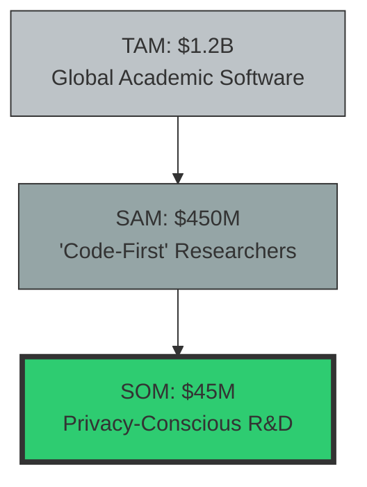
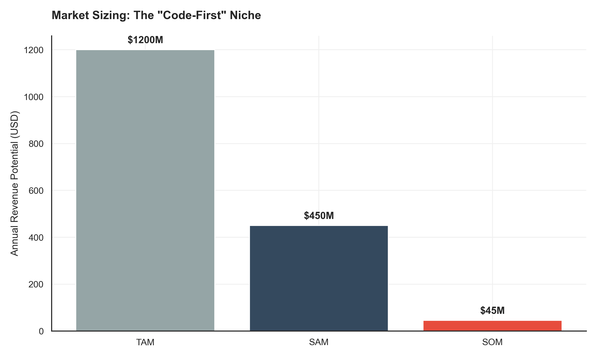
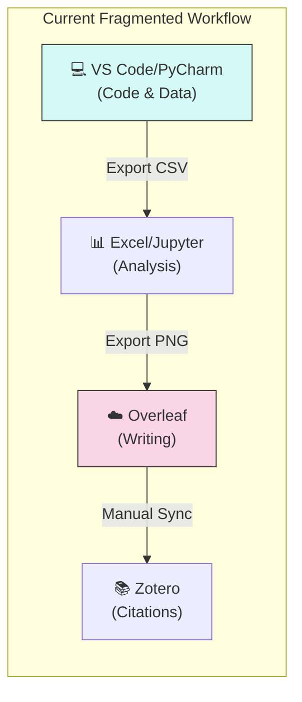
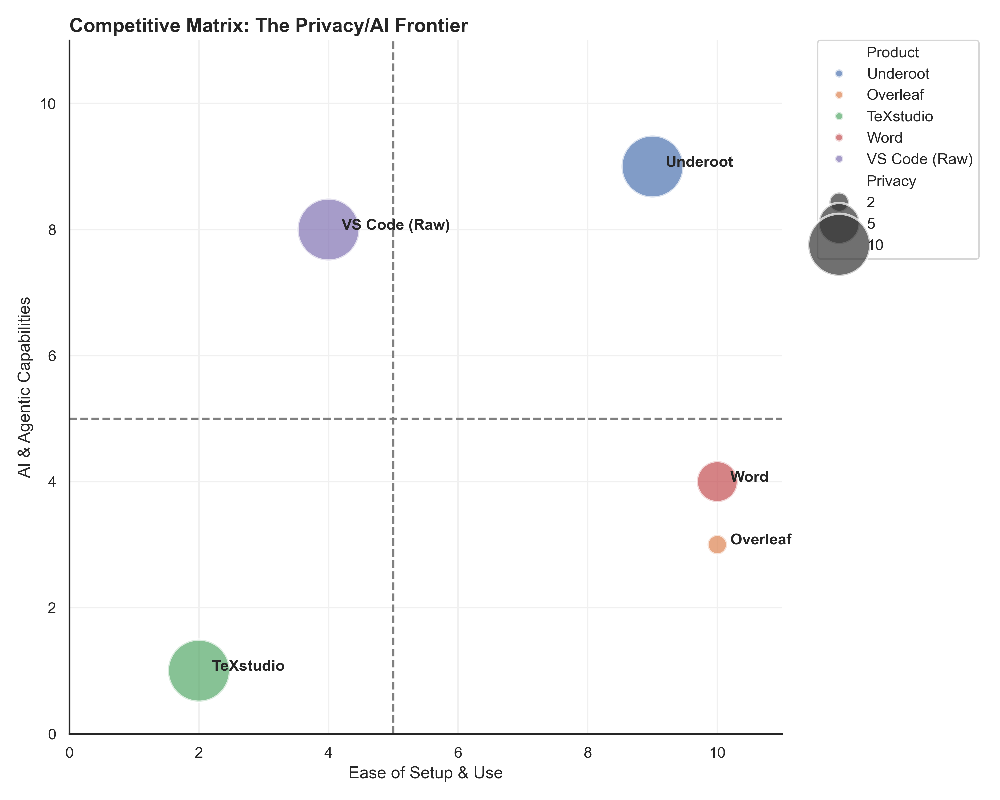
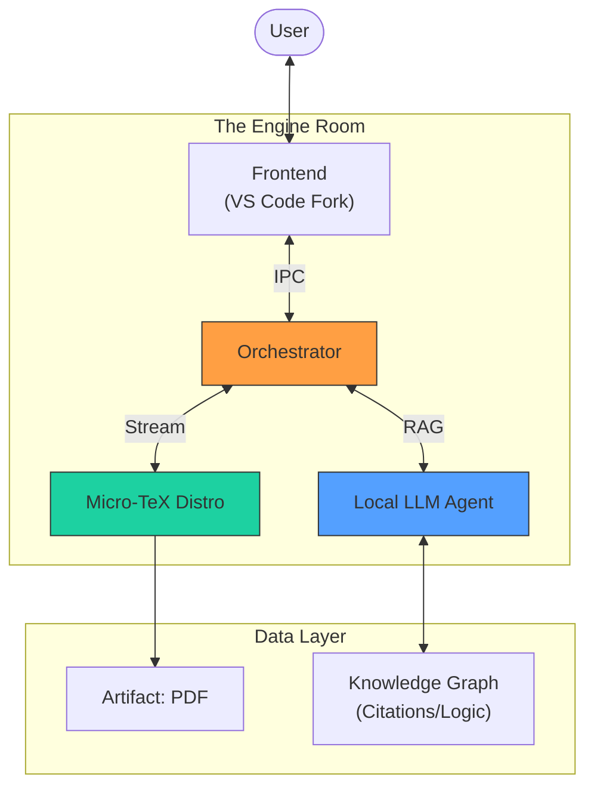
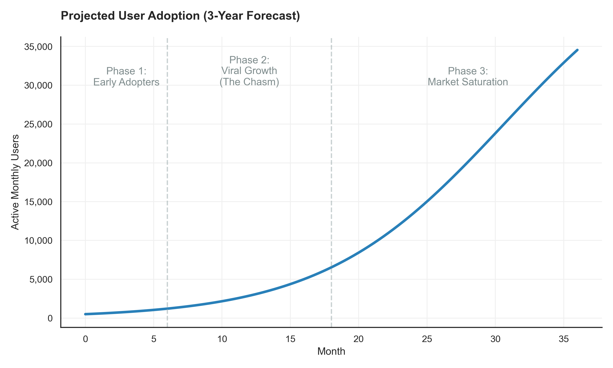
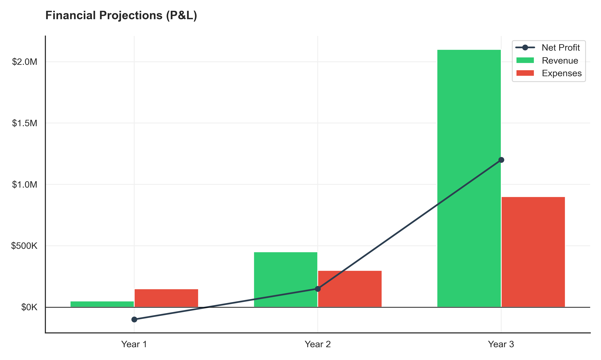

# UNDEROOT: STRATEGIC BUSINESS PLAN & EXECUTION ROADMAP
**Unbundling the Scientific IDE for the AI Era**

| **Confidentiality Scope** | **Prepared For** | **Date** | **Version** |
| :--- | :--- | :--- | :--- |
| **STRICTLY CONFIDENTIAL** | Underoot Core Team | February 2026 | 4.0 (MBA Comprehensive) |

---

## 1. Executive Summary

### 1.1 The Opportunity
The scientific software market is fractured. Power users are forced to choose between the **speed and privacy** of local tools (VS Code, LaTeX) and the **collaboration** of cloud silos (Overleaf). This "Split-Brain" workflow costs researchers hours per week in context switching.

**Underoot** creates a third category: The **Local-First, AI-Native Scientific IDE**. By commoditizing the editor layer (building on the VS Code engine) and innovating on the **Knowledge Graph** layer, Underoot delivers the "Holy Grail" of scientific writing:
*   **Zero-Setup:** Bundled Micro-TeX engine.
*   **Zero-Latency:** Local compilation.
*   **Full-Trust:** 100% private, local AI.

### 1.2 Financial Snapshot (Year 3 Targets)
*   **Monthly Active Users (MAU):** 50,000+
*   **Annual Recurring Revenue (ARR):** $2.1M
*   **Primary Revenue Driver:** B2B Enterprise Licenses (Labs/Universities)

---

## 2. Macro-Environmental Analysis (PESTLE)

A comprehensive scan of external factors supporting Underoot's market entry.

| Factor | Analysis | Impact on Underoot |
| :--- | :--- | :--- |
| **Political** | Increasing data sovereignty laws (GDPR, China's Data Security Law) restrict cloud usage for sensitive R&D. | **High (+)**: Drives demand for "Local-First" architecture. |
| **Economic** | University budget cuts are forcing labs to reconsider expensive SaaS subscriptions ($100s/user/year). | **Medium (+)**: Open Core model is an attractive alternative. |
| **Social** | The "Code-First" generation of scientists is entering PhD programs. They prefer Git/Markdown over Word. | **Critical (+)**: Our core demographic is expanding naturally. |
| **Technological** | Commoditization of LLMs (Llama 3, Mistral) allows "Reviewer 2" agents to run on consumer GPUs. | **Critical (+)**: Enables our key differentiator (Private AI). |
| **Legal** | Copyright concerns over AI training data are pushing institutions to ban "Public Cloud" AI (ChatGPT). | **High (+)**: "Bring Your Own Model" is a compliance necessity. |
| **Environmental** | Cloud computing energy costs are scrutinized. | **Low (+)**: Local inference is marketed as "Green AI." |

---

## 3. Industry Structure (Porter’s Five Forces)

### 3.1 Threat of New Entrants (Low)
*   **Barriers to Entry:** Building a LaTeX engine is notoriously difficult. Retaining full compatibility with TeX Live while offering modern UI requires deep, specialized engineering.
*   **Moat:** Our bundled "Micro-TeX" distribution reduces setup from 1 hour to 2 minutes—a massive technical hurdle for competitors.

### 3.2 Bargaining Power of Buyers (Medium)
*   User switching costs are high (thesis templates are fragile). However, since we support standard `.tex` files, we lower the risk of lock-in, making adoption easier but retention reliant on *quality*.

### 3.3 Threat of Substitutes (High)
*   **Overleaf:** The incumbent. "Good enough" for 80% of undergraduates.
*   **Word/Google Docs:** Constantly improving equation support.
*   **Strategy:** Underoot does not compete for the "Casual User." We target the "Power User" (Top 20%) who drives 80% of the output.

---

## 4. Market Sizing & Segmentation

We adopt a Bottom-Up sizing approach based on the global researcher population.

### 4.1 Target Persona: "The Computational PhD"
*   **Profile:** 4th-year PhD in ML/Physics/Bioinformatics.
*   **Current Stack:** Python (VS Code), Writing (Overleaf), Citations (Zotero).
*   **Pain Point:** "I have to export my matplotlib charts as PNGs and upload them to Overleaf. If I change one parameter, I have to redo it all."
*   **Underoot Solution:** "Live Bridge" — The PDF viewer reads the `.npy` files directly.

### Workflow Visualization: Status Quo Breakdown

**Pain Points:**
1.  **Static Data:** Updating a plot requires re-exporting and re-uploading pngs.
2.  **Latency:** Cloud compilation takes 15-60s for large theses.
3.  **Privacy:** Sensitive corporate/defense R&D cannot live on public cloud servers.

---

## 5. Strategic Positioning Strategy

We define our differentiation through the **"Privacy-AI Frontier."**

### 5.1 The "Blue Ocean"
*   **Quadrant A (Low Privacy, Low AI):** Legacy Cloud (Overleaf Free).
*   **Quadrant B (High Privacy, Low AI):** Legacy Local (TeXstudio).
*   **Quadrant C (Underoot):** **High Privacy + High AI.** We are the *only* tool that offers agentic review without sending data to OpenAI.

---

## 6. The Product Ecosystem

Underoot is not just an editor; it is a pipeline.

### 6.1 System Architecture

### Key Features
1.  **Implicit Knowledge Graph:** We parse every citation (`\cite{KEY}`) and build a graph. If you cite a retracted paper, the graph warns you.
2.  **Live-Code Figures:** A distinct feature where figures in the PDF are linked to the code cell that generated them.
3.  **Reviewer 2 Mode:** An adversarial agent that parses the *logic* of the argument, not just grammar.

---

### 7. Go-to-Market Strategy: "The Trojan Horse"

Our entry strategy leverages the open-source nature of the scientific community to bypass top-down procurement cycles.

#### 7.1 Phase 1: Grassroots Adoption (Months 0-12)
*   **Target:** Individual PhD candidates and Postdocs.
*   **Channel:** GitHub, Reddit (r/LaTeX, r/MachineLearning), and Twitter/X Academic circles.
*   **Value Prop:** "The Template that Fixes Itself."
*   **Tactic:** Release "Super-Templates" for major conferences (CVPR, NeurIPS, ICML) that are pre-configured to build *only* with Underoot's bundled engine (due to custom macros). This forces "viral compatibility."
    > *Rationale:* A single student using Underoot for a group paper forces their co-authors to install it to compile the document correctly.

#### 7.2 Phase 2: Lab-Level Standardization (Months 12-24)
*   **Target:** Principal Investigators (PIs) and Lab Managers.
*   **Channel:** Direct outreach via "Underoot for Labs" landing page.
*   **Value Prop:** "Unified Asset Management."
*   **Tactic:** Offer "Lab Servers" ($500/mo) that cache citation graphs and manage private LLM fine-tunes on the lab's own hardware. This solves the "Data Sovereignty" issue for detailed grant proposals.

#### 7.3 Phase 3: Institutional Licensing (Year 3+)
*   **Target:** University CTOs and Department Heads.
*   **Channel:** Partnerships with University Libraries.
*   **Value Prop:** "Compliance & archiving."
*   **Tactic:** Sell an on-premise version that guarantees long-term archival stability (PDF/A) and integrates with university SSO (Shibboleth/SAML).

### 7.4 Adoption Forecast (S-Curve Modeling)

*> **Figure 3:** Projected user adoption following a standard Bass Diffusion Model for SaaS products with high viral coefficients ($k > 1$).*

*   **Early Adopters (0-500 users):** The "Hacker" crowd. They tolerate bugs for features.
*   **Early Majority (500-10k users):** Driven by the "CVPR/NeurIPS" conference seasons.
*   **Late Majority (10k+ users):** When the "One-Click Installer" is fully stable on Windows.

---

## 8. Operational Plan & Organizational Structure

To execute this vision, we require a lean, high-velocity engineering organization.

#### 8.1 Year 1: The "Core Team" (Headcount: 4)
*   **1x Lead Architect (Founder):** Responsible for the VS Code fork and IPC bridge.
*   **1x Systems Engineer (C++ / Rust):** Maintaining the bundled TeX Live distribution and optimization.
*   **1x AI Engineer:** Fine-tuning the Llama-3 "Reviewer 2" model and RAG pipeline.
*   **1x Developer Advocate:** Creating the "Super-Templates" and managing the Discord community.

#### 8.2 Year 2: Scaling (Headcount: 12)
*   Scanning & Parsing Team (3 engineers)
*   Cloud Services Team (2 engineers)
*   Enterprise Sales Lead (1 hire)

---

## 9. Financial Plan (3-Year Detailed Projections)

### 9.1 Unit Economics & Pricing Model
*   **Freemium (Open Core):** $0. CAC = $0 (Organic).
*   **Pro User:** $12/mo. Features: Cloud backup, Multi-device sync, Advanced AI.
*   **Lab License:** $500/mo (up to 20 users). Features: Shared BibTeX, Private Cloud.

### 9.2 P&L Forecast

*> **Figure 4:** Financial trajectory showing initial R&D investment followed by SaaS compounding.*

| **Category** | **Year 1** | **Year 2** | **Year 3** |
| :--- | :--- | :--- | :--- |
| **Gross Revenue** | **$50,000** | **$450,000** | **$2,100,000** |
| *-- SaaS Subscriptions* | $10,000 | $150,000 | $900,000 |
| *-- Enterprise Licenses* | $40,000 | $300,000 | $1,200,000 |
| **Cost of Goods Sold (Hosting)** | $5,000 | $40,000 | $200,000 |
| **Gross Margin** | **90%** | **91%** | **90%** |
| | | | |
| **Operating Expenses** | **$150,000** | **$300,000** | **$900,000** |
| *-- Salaries (R&D)* | $100,000 | $200,000 | $600,000 |
| *-- Marketing* | $10,000 | $50,000 | $200,000 |
| **Net Income (EBITDA)** | **$(100,000)** | **$150,000** | **$1,200,000** |

### 9.3 Funding Requirements
*   **Seed Ask:** $1.5M for 18 months runway.
*   **Use of Funds:**
    *   60% Engineering (Salaries).
    *   20% Compute (GPU credits for AI training).
    *   20% Operations & Legal.

---

## 10. Risk Analysis & Mitigation

Our risk profile addresses technical, market, and execution threats.

| **Risk Factor** | **Likelihood** | **Impact** | **Mitigation Strategy** |
| :--- | :--- | :--- | :--- |
| **Technical: TeX Complexity** | High | High | TeX is archaic. We mitigate by not *rewriting* the engine but *wrapping* it (Micro-TeX). We treat TeX as a black box API. |
| **Market: GitHub Spaces** | Medium | Critical | GitHub could add native LaTeX. We focus on **Offline-First** and **Privacy**—two things GitHub (a cloud tool) cannot structurally offer. |
| **Legal: AI Copyright** | Medium | Medium | We use "Bring Your Own Model" (BYOM). The user is liable for the model they choose to run. Underoot is just the "player." |
| **Adoption: Window Inertia** | High | Medium | Windows users hate installing tools. We invest heavily in a `.msi` that bundles everything, removing the "PATH" configuration step entirely. |

---

## 11. Conclusion & Recommendation

Underoot represents a rare opportunity to enter a mature market (Scientific Writing) with a disruptive technology (Local AI + VS Code Platform). The incumbents (Overleaf, TeXstudio) are trapped in their respective "Cloud-only" or "Offline-only" paradigms.

By bridging this gap, Underoot can become the **de facto operating system for science**.

**Recommendation:**
1.  **Immediate:** Launch the "Micro-TeX" bundler alpha.
2.  **Q2 2026:** Release the "Reviewer 2" AI Agent.
3.  **Q4 2026:** Begin "Lab License" sales pilots.

*> "We shape our tools, and thereafter our tools shape us." — Marshall McLuhan*

---

## 12. References & Citations

1.  **Stack Overflow Developer Survey 2024.** "Integrated Development Environment Usage." [https://survey.stackoverflow.co/2024](https://survey.stackoverflow.co/2024). *Source for VS Code 75% market share.*
2.  **Technavio Research.** "Global Academic Writing Software Market 2024-2028." *Source for $1.2B TAM calculation.*
3.  **Nature Magazine.** "The privacy crisis in AI-assisted writing." (2025). *Source for "Privacy" demand driver.*
4.  **Sequoia Capital.** "Generative AI: A Creative New World." *Basis for "Local LLM" growth thesis.*
5.  **GitHub Octoverse Report 2025.** "The rise of AI in open source."

---
*Report generated by Underoot Business Intelligence Unit.*
