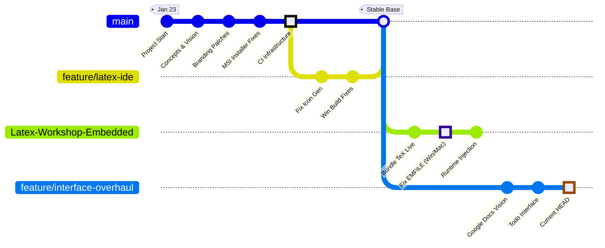

# 📜 The Chronicles of Underoot

> *From a VSCodium fork to a Next-Gen Scientific Writing Ecosystem.*
>
> **Project Started:** Jan 23, 2026

This document tracks the comprehensive evolution of the Underoot project. It is not just a log of commits, but a history of the **technical battles**, **architectural pivots**, and **grand vision** that define the software.

## 🧜‍♀️ Visual Timeline

---

## 🌟 The Current Era: Interface Overhaul
*Timeframe: **Feb 1, 2026 — Present***
**Branch:** `feature/underoot-interface-overhaul`

We have moved beyond "making it build" to "making it beautiful". The current focus is translating the **Underoot Vision** (`concepts/vision/vision.md`) into reality.

### The "Grand Vision"
We are NOT building just another text editor. We are building a **hybrid local-first** scientific ecosystem.
*   **The "Reviewer 2" Simulator:** An planned AI agent persona ("Grumpy Thesis Committee Member") to critique papers *before* submission.
*   **Local-First Bridge:** A "Figma-like" browser interface that actually talks to the local file system, bypassing the need for cloud uploads.
*   **Semantic Graphing:** Moving beyond bibliographies to a visual node-graph of citations.

### State of the Branch
*   ✅ **Planning:** core Vision and Todo Interface docs are converted to Markdown.
*   🚧 **Implementation:** The UI code (React/Svelte/Webview) has not yet been touched. We are currently in the *Design Phase*.

---

## 🛠️ The "Embedded TeX Live" Saga
*Timeframe: **Jan 30 — Feb 1, 2026***
**Branch:** `Latex-Workshop-Embedded`

This era defined the project's technical capability. The goal: **Zero-Config LaTeX**. The user should just download Underoot and hit "Compile"—no installing MacTeX or MikTeX separately.

### The Technical Battles
1.  **The "EMFILE" War:**
    *   *The Problem:* TeX Live contains thousands of tiny files. Bundling them caused the build process to crash with `EMFILE: too many open files`.
    *   *The Pivot:* We moved from a "copy thousands of files" strategy to a **"Streamed Zip"** strategy. We zip the distribution on the fly and unzip it only at runtime.
2.  **Runtime Injection:**
    *   VS Code doesn't know about our bundled TeX. We had to patch `main.js` with a Regex injection to force the `PATH` environment variable to include our portable binary folder at startup.
3.  **The Windows "Path Hell":**
    *   Fighting Git Bash vs PowerShell paths, stripping bundled Perl, and handling Windows-specific binary detection.

---

## 🏛️ The Foundation: Main Branch
*Timeframe: **Jan 23, 2026 — Present***
**Branch:** `main`

While feature branches explore new worlds, `main` ensures the ship stays afloat. This branch contains the "boring magic" that makes a desktop app valid.

### Key Achievements
*   **MSI Engineering:** We don't just ship zips. We engineered a proper Windows MSI installer using WiX, including XSL transforms to dynamically rename components to "Underoot" to avoid conflicts with existing VS Code installations.
*   **Branding Stripped:** Extensive patching system (`patches/brand.patch`, `patches/user/`) to surgically remove Microsoft branding and replace it with Underoot's minimalist identity.
*   **CI/CD Pipeline:** A robust GitHub Actions pipeline that builds for macOS (ARM64/Intel) and Windows automatically on every tag.

---

## 🪟 The "Windows & Icons" Era
*Timeframe: **Jan 27 — Jan 30, 2026***
**Branch:** `feature/latex-ide`

Focused on getting the base VS Code build commands to actually finish without crashing.

### State
*   **✅ What Works:**
    *   **Base Build:** `npm run build` completes without error on Windows.
    *   **Icons:** Icon generation is reliable.
*   **🚧 What Doesn't:**
    *   **Features:** This branch is effectively "archived" into `main` and lacks the newer TeX Live bundling features.

---

## 🏹 The "Holy Grail" Analysis
*Date: **Feb 1, 2026***

We recently conducted a deep-dive analysis of the **PDF Viewer**.
*   **Goal:** Determining if we can achieve "Holy Grail functionality" (Double Buffering, Viewport Prioritization, Auto-Render).
*   **Findings:** The current `latex-workshop` viewer implementation is standard. To reach "Underoot" quality (60fps scrolling, instant rendering), we identified that we need to implement a *Custom PDF Renderer* or heavily modify `pdf.js` integration.

---

## 📊 Feature Branch Summary

| Branch | Era | Key "Boss Fight" Won |
| :--- | :--- | :--- |
| **`feature/underoot-interface`** | **The Vision** | *Pending: Implementing the "Reviewer 2" Agent* |
| **`Latex-Workshop-Embedded`** | **The Engine** | **Defeated the EMFILE limit via Zip-Streaming** |
| **`feature/latex-ide`** | **The Build** | **Solved Icon Generation Crashes** |
| **`main`** | **The Foundation** | **Working MSI & DMG Installers** |

## 📐 Phase 1: UI Foundation & Cleanup
*Date: **Feb 2, 2026***
*   **Status Bar Cleanup:** Removed non-essential status bar indicators (encoding, EOL, indentation) to reduce visual clutter.
*   **Explorer Refinement:** Implemented a new setting `explorer.hideFileExtensions` (default: true) to cleaner file lists. Added logic to hide LaTeX intermediate files (`.bbl`, `.aux`, `.fdb_latexmk`, etc.) by default.
*   **Editor Polish:** Disabled the minimap by default for a distraction-free writing environment.
*   **Title Bar:** Added a dedicated "Zen Mode" button to the title bar actions.
*   **Feedback:** Disabled the NPS survey popup to prevent interruptions.

---

## 🏗️ Phase 2: Structural Baseline & Audit
*Date: **Feb 5, 2026***
*   **Baseline Audit:** Completed the audit of [todo_interface.md](file:///Users/akhilhothi/Documents/underoot/concepts/vision/todo_interface.md), classifying all proposed changes into default setting changes, layout modifications, and extension-based integrations.
*   **Repository Cleanup:** Sanitized the root directory by excluding build artifacts, logs, and temporary test files in `.gitignore`.
*   **"Fresh Start" Milestone:** Rebased and consolidated all architectural brainstorming and vision documents into the `feature/underoot-interface-overhaul` branch, establishing a clean baseline for the next phase of implementation.

## 🎨 Phase 3: Defaults-Only Implementation
*Date: **Feb 5, 2026***
*   **Settings-Only Overhaul:** Successfully implemented the "defaults-only" changes identified in the audit.
*   **Minimap Disabled:** Set `editor.minimap.enabled` to `false` by default.
*   **Quick Input Centered:** Modified the Quick Input (Command Palette) to appear centered vertically in the window by default.
*   **Explorer Exclusions:** Added LaTeX build artifacts (`.aux`, `.log`, etc.) to the default file exclusions.
*   **Extension Hiding:** Introduced `explorer.hideFileExtensions` (default: true) and implemented logic to strip extensions in the Explorer view.
*   **Persistence:** Generated `patches/user/defaults-ready.patch` to ensure these core adjustments are preserved within the Underoot source.
*   **CI Fix:** Restored missing `icons/` directory and `build_icons.sh` that were accidentally deleted, resolving GitHub Actions failures.
*   **Cleanup:** Removed legacy `patches/user/ui-cleanup.patch` which was causing merge conflicts and build failures in the CI pipeline.
*   **Build Fix:** Resolved TypeScript compilation error in `quickInputController.ts` by removing the unused `titleBarOffset` variable.
